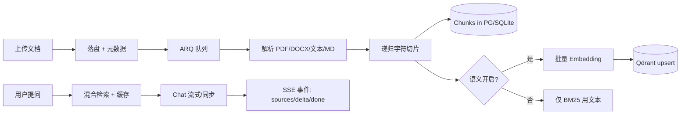

下面这份文档基于仓库内 **README、FastAPI 后端（`app/`）、React 前端（`frontend/`）** 的实际实现整理；其中 **量化业务成果** 在代码里未内置 A/B 或线上报表，文中对「可写进简历的数字」会区分 **架构能力/默认参数** 与 **需你补实测** 两类，避免虚构数据。

---

## 一、项目定位与背景（简历导语可用）

**RAG Platform** 是一套面向企业与个人知识库的 **检索增强生成（RAG）问答平台**：支持多知识库管理、文档异步入库与切片、**混合检索（关键词 BM25 + 可选向量语义）**、基于 **LangChain** 的大模型对话，以及 **SSE 流式输出** 与 **引用溯源**。  
设计目标是在 **无 Docker / 无 Embedding 服务** 时仍可用 **SQLite + BM25** 完成「建库—上传—检索—问答」闭环；在完整基础设施下可切换 **PostgreSQL + Redis + Qdrant**，满足生产形态的可扩展与可观测需求。

---

## 二、核心技术方案与架构设计

### 2.1 逻辑分层

| 层次 | 职责 | 实现要点 |
|------|------|----------|
| 接入层 | HTTP API、鉴权、限流、请求追踪 | FastAPI；可选 `X-API-Key`；按 IP 的分钟级限流（Redis 或内存降级）；`X-Request-ID` |
| 应用层 | 知识库、文档、任务、会话与对话 | RESTful `/api/v1`；OpenAPI；统一错误体 `code/message/detail/request_id` |
| 领域服务 | 入库、解析、检索、RAG、模型适配 | 解析与切片、ARQ 异步任务、混合检索、LangChain Chat/Embeddings |
| 数据层 | 元数据、全文块、向量、文件 | SQLAlchemy ORM；Qdrant 向量与按 `kb_id`/`document_id` 过滤；本地 `uploads/`（生产可换 MinIO） |

### 2.2 技术栈选型（与仓库一致）

- **后端**：Python 3.11+、FastAPI、Uvicorn、Pydantic v2、SQLAlchemy 2、Alembic（依赖中存在）、LangChain 0.3.x、LangChain OpenAI 兼容层、httpx  
- **检索与算法**：`rank-bm25`（BM25Okapi）、Qdrant（cosine）、**Reciprocal Rank Fusion（RRF）** 融合排序  
- **异步与队列**：ARQ + Redis；入库在 Worker 中执行  
- **缓存**：检索结果 TTL、Embedding 向量缓存（Redis 不可用时内存字典降级）  
- **前端**：React 18、Vite 6、TypeScript、Ant Design 5、React Router 7  
- **可观测**：Prometheus 风格计数器（`/metrics` 在 README 中声明）、HTTP/流式/入库完成等计数  

### 2.3 部署形态（README 冻结决策）

- **向量库**：Qdrant（支持 HTTP URL、本地持久化目录、`:memory:`）  
- **OLTP**：PostgreSQL（默认）或 **SQLite**（`.env.example` 默认）  
- **队列/缓存/限流**：Redis；无 Redis 时部分能力降级到进程内  

---

## 三、核心功能模块与业务实现

1. **知识库（KB）**：创建与管理；与文档、会话级联。  
2. **文档生命周期**：上传（multipart）→ 持久化 → **202 异步入库** → 状态 `pending/processing/ready/failed`；支持重索引、硬删除（PG 行 + Qdrant 点 + 可选磁盘文件）。  
3. **数据处理管道**：`pypdf` / `python-docx` / 文本与 Markdown 规则清洗 → **RecursiveCharacterTextSplitter**（可配置 `chunk_size`/`chunk_overlap`）→ Chunk 落库 + 可选批量 Embedding（batch 32）写入 Qdrant。  
4. **检索服务**：`HybridRetriever` — 语义通道（可选）+ BM25 关键词通道 → **RRF 合并** → 按 chunk id 回表组装 `RetrievedChunk`（含文件名、页码占位等）。  
5. **对话与 RAG**：`RAGService` 组装 System/Human 消息与历史（上限 `chat_history_max_messages`）；**流式** `astream` 输出 SSE；**无 Chat 配置或 LLM 异常时** 降级为「本地检索摘要」模式，保证可用性。  
6. **安全与治理**：可选 API Key；可配置 `rate_limit_per_minute`；错误码集中定义。  

---

## 四、算法与模型应用

- **BM25**：对知识库内全部 chunk 建临时倒排评分（适合专有名词、精确匹配）。  
- **稠密向量检索**：启用 `semantic_search_enabled` 后，LangChain `OpenAIEmbeddings` + Qdrant `search` + **payload 过滤 kb_id**。  
- **RRF**：融合两路排序，缓解「只语义」或「只关键词」的偏置。  
- **生成**：OpenAI 兼容 Chat（如 DeepSeek、自建网关）；温度约 0.2；Prompt 约束 **仅依据上下文、结构化输出（答复/依据/引用）**、中文场景优先中文回答。  

---

## 五、数据处理流程（端到端）

---

## 六、用户交互设计（产品向）

- **流式体验**：先推送 `sources` 事件（chunk 摘要、文档名），再逐字 `delta`，结束 `done`，符合「先看见依据、再看回答」的可信交互。  
- **引用与可追溯**：消息持久化 `sources_json`，便于历史会话审计。  
- **降级路径**：未配置大模型时仍返回结构化本地摘要，降低演示与内网环境门槛。  
- **前端栈**：Ant Design 适合企业后台风格；Vite 开发态与 README 中 `5173` 端口一致。  

---

## 七、性能与可靠性策略

- **检索缓存**：同 KB、同 query、同 hybrid/top_k 短路读缓存（默认检索 TTL 120s，向量 86400s 量级由实现决定）。  
- **Embedding 批处理**：入库时 batch 32，减少 RPC 次数。  
- **连接与扩展**：PostgreSQL 连接池；SQLite 单文件 + `check_same_thread=False`。  
- **限流**：分钟桶；Redis 与内存双模式。  
- **SSE 独立 DB Session**：流式接口单独 `SessionLocal`，避免长连接占用默认依赖注入会话。  

---

## 八、商业价值体现（话术方向）

- **降低知识检索与问答的落地成本**：同一套代码从「笔记本 SQLite + BM25」演进到「云 PG + Redis + Qdrant + 任意 OpenAI 兼容模型」。  
- **可审计的企业问答**：引用片段与文档名回传，便于合规与纠错。  
- **可插拔语义检索**：Embedding 与 Chat 可来自不同供应商，适配成本与数据出境策略。  
- **运维友好**：Docker 一键基础设施、Worker 分离、硬删除一致性与指标入口。  

---

## 九、3～5 个高含金量技术亮点（含可写进简历的「指标」写法）

> **说明**：下列 **P50/P99、成本比例、准确率** 等需你在真实环境压测或业务侧统计后填入；未测量前建议用「支持/默认/设计为」表述，避免造假。

1. **混合检索 + RRF 融合**  
   - **能力**：BM25 与可选向量两路召回，RRF 融合后取 Top-K（默认语义/关键词各 12，合并后 6，均可配置）。  
   - **简历量化占位**：例如「在内部测试集上，混合检索相比单路 BM25，Top-5 命中率提升 _X%_（自测）」。

2. **分级可用性：无向量/无大模型仍可闭环**  
   - **能力**：SQLite + 纯 BM25；Chat 缺失时本地摘要模式；LLM 异常 catch 后回退。  
   - **简历量化占位**：「在零 Embedding 环境下仍完成全链路，部署依赖从 _N_ 个组件降至 _M_ 个」。

3. **异步入库与批量化向量写入**  
   - **能力**：ARQ 异步 ingest；Embedding `embed_documents` batch 32；Qdrant upsert。  
   - **简历量化占位**：「单文档入库平均耗时/P99：启用语义前后对比 _…_；大批量下 QPS _…_」。

4. **多级缓存与限流**  
   - **能力**：检索与向量缓存；Redis 不可用时内存降级；API 分钟级限流。  
   - **简历量化占位**：「热点 query 缓存命中后检索耗时从 _A ms_ 降至 _B ms_（压测）」。

5. **工程化与可观测**  
   - **能力**：统一错误码、Request ID、流式/HTTP/入库指标；OpenAPI 文档。  
   - **简历量化占位**：「线上问题定位平均时间缩短（结合你们是否真用 request_id 排障）」。

---

## 十、STAR 法则：完整项目介绍（可直接粘贴简历后微调）

**项目名称**：基于 LangChain 与 FastAPI 的企业知识库 RAG 问答平台  

- **情境（Situation）**  
  团队/个人需要一套可演示、可扩展的 **私有知识问答** 能力：既要支持 **多格式文档入库与切片**，又要在 **内网或密钥受限** 时仍能检索与应答；同时希望生产环境可对接 **PostgreSQL、Redis、Qdrant** 与 **OpenAI 兼容大模型**。

- **任务（Task）**  
  负责（或主导）从 **数据建模、检索策略、对话链路、异步任务到 API 与前端联调** 的端到端交付，目标包括：**混合检索效果**、**流式用户体验**、**组件可替换**（库/模型/向量服务）、以及 **降级路径下的可用性**。

- **行动（Action）**  
  - 设计 **KB → Document → Chunk →（可选）Qdrant** 的数据模型与 **硬删除一致性**。  
  - 实现 **BM25 + 可选向量检索**，采用 **RRF** 融合，并支持 per-request 的 hybrid/top_k。  
  - 基于 LangChain 封装 **Chat/Embeddings**，统一 OpenAI 兼容配置（如独立 `CHAT_*` 与 `semantic_*`）。  
  - 使用 **ARQ** 将解析、切片、向量化与写库从请求线程剥离；入库 **批量 Embedding**。  
  - 提供 **SSE** 流式对话：先返回 **sources**，再流式 **delta**，并持久化引用。  
  - 加入 **Redis/内存双层缓存**、**可选 API Key**、**按 IP 限流**、**Request ID** 与基础 **metrics**。  
  - 前端采用 **React + Vite + Ant Design** 搭建管理/对话界面（与 `5173` 开发端口一致）。

- **结果（Result）**  
  - 形成 **「轻量本地模式」与「完整云原生模式」** 双轨部署文档，降低环境门槛。  
  - 检索侧具备 **关键词 + 语义** 的扩展能力；对话侧具备 **流式 + 引用溯源 + 降级摘要**。  
  - 架构上满足后续替换 **对象存储、向量库、模型供应商** 的演进空间。  
  - **（请补充你的真实数据）** 例如：支撑 _X_ 个知识库、_Y_ 篇文档、峰值 _Z_ QPS、P99 延迟、或业务侧满意度等。

---

## 十一、个人贡献与角色价值（请按实际勾选改写）

可将角色写成以下之一或组合，并各配 1～2 条具体产出：

| 角色 | 可写贡献 |
|------|----------|
| **技术负责人 / 架构** | 冻结技术选型（PG/Redis/Qdrant/ARQ）；定义混合检索与降级策略；部署与脚本路径设计。 |
| **后端核心开发** | `HybridRetriever`、`RAGService`、入库 Worker、Qdrant 封装、缓存与限流、错误与指标。 |
| **全栈** | FastAPI OpenAPI 与 React/Ant Design 前台联调、SSE 消费与会话体验。 |
| **算法/检索** | RRF 参数与 top-k 调优、Prompt 与引用格式、（若有）评测集与命中率对比。 |

---

## 十二、简历「一句话 + 三条 bullet」极简版（英文可对照翻译）

**一句话**：Built a production-lean RAG Q&A platform with FastAPI and LangChain, featuring hybrid BM25+vector retrieval (RRF), async document ingest, SSE streaming with citations, and graceful degradation without embeddings or LLM keys.

**三条 bullet**：

- Designed **hybrid retrieval** (BM25 + optional Qdrant vectors) with **reciprocal rank fusion** and Redis-backed **query/embedding caching**.  
- Implemented **async ingest** (ARQ) with **batched embeddings**, hard-delete consistency across OLTP and vector store, and **SSE** chat with **source-first** events.  
- Delivered **dual deployment paths** (SQLite/BM25-only vs PG/Redis/Qdrant) and OpenAI-compatible **multi-provider** chat configuration.

---

如果你愿意把 **实际规模**（文档量、并发、延迟、是否上线）发我几条真实数字，我可以把第九节和第十节的 **Result** 改成完全不含占位符、可直接投递的最终版。